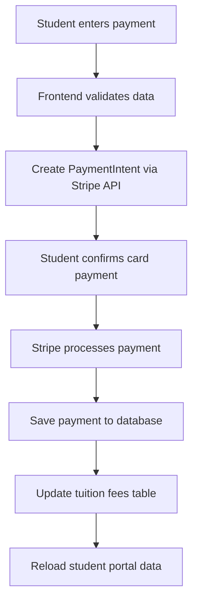

# 🎓 Student Payment System - Complete Integration Guide

## Overview
This system integrates **Stripe payments** with a **PHP/MySQL backend** to allow students to pay their tuition fees directly from the portal. Payments are automatically saved to the database and applied to pending tuition fees.

---

## 🗄️ Database Setup

### 1. Create Payment Tables
Run the SQL script to create all necessary tables:

```bash
mysql -u your_user -p citiedge_portal < SETUP_PAYMENT_TABLES.sql
```

Or use the API endpoint:
```bash
curl -X GET "https://portals.citiedge.uk/public_html/student_api.php?action=createPaymentTables" \
  -H "X-API-KEY: super-secret-key"
```

### 2. Tables Created

#### `student_payments`
Stores all payment transactions from Stripe:
- Student information
- Payment details (amount, type, currency)
- Stripe IDs (payment_intent_id, charge_id)
- Payment status and timestamps

#### `student_tuition_fees`
Stores tuition fee records:
- Academic year and semester
- Total amount, paid amount, due amount
- Due date and payment status
- Auto-updates when payments are made

---

## ⚙️ Environment Configuration

### 1. Copy `.env.example` to `.env.local`
```bash
cp .env.example .env.local
```

### 2. Configure Environment Variables

```env
# Stripe Keys (from https://dashboard.stripe.com/apikeys)
NEXT_PUBLIC_STRIPE_PUBLISHABLE_KEY=pk_test_...
STRIPE_SECRET_KEY=sk_test_...

# API Configuration
API_BASE_URL=https://portal.citiedge.uk/public_html
NEXT_PUBLIC_API_BASE_URL=https://portal.citiedge.uk/public_html
API_KEY=super-secret-key
NEXT_PUBLIC_API_KEY=super-secret-key
```

### 3. Vercel Environment Variables
Add these in Vercel Dashboard → Settings → Environment Variables:
- `NEXT_PUBLIC_STRIPE_PUBLISHABLE_KEY`
- `STRIPE_SECRET_KEY`
- `API_BASE_URL`
- `API_KEY`

---

## 🚀 How It Works

### Payment Flow



### 1. **Student Initiates Payment**
- Navigates to Payments tab in portal
- Selects payment type (Tuition Fee, etc.)
- Enters amount
- Provides card details

### 2. **Stripe Processing**
- Frontend calls `/api/stripe/create-payment-intent`
- Stripe creates PaymentIntent
- Student confirms with card details
- Stripe charges the card

### 3. **Database Recording**
- Frontend calls `/api/stripe/save-payment`
- Payment saved to `student_payments` table
- If payment type is "Tuition Fee":
  - Updates `student_tuition_fees` table
  - Increases `paid_amount`
  - Decreases `due_amount`
  - Updates status to "paid" if fully paid

### 4. **Portal Update**
- Payment history refreshes automatically
- Tuition fee status updates
- Due amount reflects new payment

---

## 📡 API Endpoints

### Payment Endpoints

#### Save Payment
```http
POST /public_html/student_api.php?action=savePayment
Headers:
  X-API-KEY: super-secret-key
  Content-Type: application/json

Body:
{
  "student_id": "STD-2024-001",
  "student_name": "John Doe",
  "student_email": "john.doe@citiedge.edu",
  "payment_type": "Tuition Fee",
  "amount": 5000.00,
  "currency": "GBP",
  "stripe_payment_intent_id": "pi_123456",
  "payment_status": "succeeded"
}
```

#### Get Payment History
```http
GET /public_html/student_api.php?action=getPaymentHistory&student_id=STD-2024-001
Headers:
  X-API-KEY: super-secret-key
```

#### Get Tuition Fees
```http
GET /public_html/student_api.php?action=getStudentTuitionFees&student_id=STD-2024-001
Headers:
  X-API-KEY: super-secret-key
```

#### Add Tuition Fee (Admin)
```http
POST /public_html/student_api.php?action=addTuitionFee
Headers:
  X-API-KEY: super-secret-key
  Content-Type: application/json

Body:
{
  "student_id": "STD-2024-001",
  "academic_year": "2026-2027",
  "semester": "Fall 2026",
  "total_amount": 15500.00,
  "due_date": "2026-09-01"
}
```

---

## 🧪 Testing

### Test Cards (Stripe Test Mode)
```
Success: 4242 4242 4242 4242
Decline: 4000 0000 0000 0002
3D Secure: 4000 0027 6000 3184

Expiry: Any future date
CVC: Any 3 digits
```

### Testing Flow
1. Login to student portal
2. Navigate to **Payments** tab
3. Enter test payment:
   - Amount: £100
   - Type: Tuition Fee
   - Card: 4242 4242 4242 4242
4. Verify:
   - Payment appears in history
   - Tuition due amount decreased
   - Database records created

---

## 🎯 Features

### ✅ Implemented
- [x] Stripe payment integration
- [x] Database payment storage
- [x] Payment history display
- [x] Tuition fee tracking
- [x] Automatic fee updates on payment
- [x] Real-time portal updates
- [x] Secure API authentication
- [x] Test and production modes

### 🔄 Payment Types Supported
- Tuition Fee (auto-applies to tuition balance)
- Registration Fee
- Exam Fee
- Library Fine
- Lab Fee
- Other Fee

---

## 🔒 Security

### API Authentication
All API requests require `X-API-KEY` header:
```javascript
headers: {
  'X-API-KEY': process.env.API_KEY
}
```

### Stripe Security
- Secret keys never exposed to frontend
- PaymentIntents created server-side only
- PCI compliance handled by Stripe
- 3D Secure support enabled

### Database Security
- Prepared statements prevent SQL injection
- Password hashing for user accounts
- HTTPS required for all transactions

---

## 📊 Database Schema

### student_payments
```sql
id, student_id, student_name, student_email,
payment_type, amount, currency,
stripe_payment_intent_id, stripe_charge_id,
payment_status, description, receipt_url,
created_at, updated_at
```

### student_tuition_fees
```sql
id, student_id, academic_year, semester,
total_amount, paid_amount, due_amount,
due_date, status, created_at, updated_at
```

---

## 🐛 Troubleshooting

### Payment Not Saving
**Check:**
1. Environment variables set correctly
2. API_KEY matches in both .env and PHP
3. Database tables exist
4. API endpoint accessible

### Tuition Not Updating
**Check:**
1. Payment type is exactly "Tuition Fee"
2. payment_status is "succeeded"
3. student_id matches tuition_fees table
4. Due amount > 0

### Stripe Errors
**Common Issues:**
1. API version mismatch → Use '2025-12-15.clover'
2. Secret key missing → Check STRIPE_SECRET_KEY
3. Amount validation → Ensure amount > 0

---

## 📞 Support

### Error Logs
Check these locations:
- Browser Console (F12)
- Vercel Function Logs
- PHP error_log
- MySQL slow query log

### Need Help?
- Check Stripe Dashboard for payment details
- Review database records
- Verify environment variables
- Test with Stripe test cards

---

## 🎉 Success!

Your student payment system is now fully integrated and operational. Students can:
- ✅ Make secure payments via Stripe
- ✅ View payment history
- ✅ See real-time tuition balances
- ✅ Track pending fees
- ✅ Download receipts

**Ready for production?** Switch to live Stripe keys and update API_BASE_URL!
